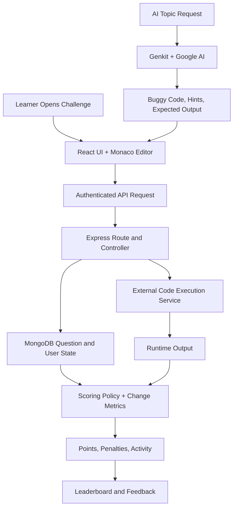

# 🐞 DEBUG QUEST

> A debugging training platform that validates fixes by runtime behavior, not copy-pasted answers.

Debug Quest is a full-stack web application built with a React frontend, an Express and MongoDB backend, and an external code-execution service. Unlike traditional coding platforms that focus on writing new programs from scratch, Debug Quest presents learners with buggy code snippets in Python, C, and JavaScript and asks them to inspect, diagnose, and fix them. The goal is to turn debugging into a structured practice loop with runtime validation, scoring, and progression across multiple difficulty levels.

## Visual Workflow

## Problem Statement

Most online coding platforms emphasize code creation but give far less attention to one of the most important software engineering skills: debugging. Beginners often struggle to understand why code fails, and they rarely get a structured environment for practicing how to inspect, isolate, and fix bugs. There is a practical need for a dedicated platform focused on debugging workflows, multi-language problem sets, and guided skill progression through interactive challenges.

## 🎯 Objectives

- Identify the limitations of coding platforms that focus mainly on code creation rather than debugging and bug-fix practice.
- Provide a unified interface where users can practice debugging code snippets in Python, C, and JavaScript across multiple difficulty levels.
- Build a responsive full-stack application with React on the frontend and an Express plus MongoDB backend for a smooth debugging workflow.
- Use AI-assisted challenge generation and hinting through Genkit with Google AI to expand practice content beyond manually curated questions.
- Integrate language-specific evaluation through an external execution service so fixes are checked by runtime behavior, not just answer matching.
- Track points, failed attempts, daily activity, and change-percentage metrics to make learner progress visible and measurable.
- Encourage minimal, targeted fixes by comparing the learner's changes against the original buggy code and enforcing change thresholds during scoring.

## Project Highlights

| Technical Feature | User Benefit |
| --- | --- |
| Runtime-based submission validation | Accepts multiple valid fixes instead of one exact answer string. |
| Change-percentage scoring | Rewards debugging discipline rather than full rewrites. |
| AI-generated buggy challenges | Expands practice content without manual authoring for every scenario. |
| Curated difficulty tiers | Gives learners a structured path from easy to hard debugging tasks. |
| Rate-limited execution and generation endpoints | Protects the platform from noisy or abusive usage patterns. |
| Admin routes for questions and moderation | Reduces operational overhead for maintaining challenge quality. |
| Vercel adapter layer over Express | Preserves one backend codebase for both local and hosted environments. |

## Technical Snapshot

| Category | Specification | Rationale |
| --- | --- | --- |
| Runtime | Node.js, React 19, Express 5, MongoDB | One JavaScript stack across client and server. |
| Deployment | Vercel adapters + external execution service | Keeps web hosting and code execution decoupled. |
| Local Orchestration | Docker Compose | Supports local infrastructure experiments and runtime services. |
| AI Integration | Genkit + Google AI (`gemini-2.5-flash`) | Produces structured challenge payloads instead of free-form text. |
| Editor | Monaco | Gives the learner an IDE-like debugging experience in-browser. |

## Deep Dive

- [Architecture](/docs/architecture.md)
- [ADR Summary](/docs/adr.md)
- [Maintainer Notes](/docs/maintainer-notes.md)

## Repository Layout

- `client/`: React application, routes, pages, UI utilities.
- `server/`: Express API, controllers, routes, models, scoring logic, AI integration.
- `api/`: Vercel adapters exposing the Express app in serverless mode.
- `docs/`: architecture, decision records, and maintainer-facing notes.

## Core Value

This project automates debugging practice, code execution, and score tracking to prevent learners from treating debugging as an unstructured, manual, and hard-to-measure exercise.

## Guide

Rema M.K

## Team Members

- John S Palatty
- I Vishnu Nath
- Ribin Babu
- Jesvin Jose
