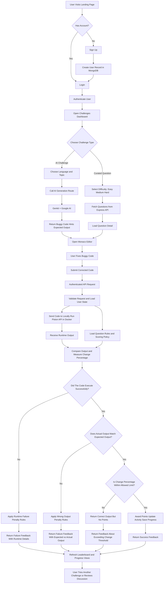

# 🐞 DEBUG QUEST

> A debugging training platform that validates fixes by runtime behavior, not copy-pasted answers.

Debug Quest is a full-stack web application built with a React frontend, an Express and MongoDB backend, and a locally run Piston API for code execution. Unlike traditional coding platforms that focus on writing new programs from scratch, Debug Quest presents learners with buggy code snippets in Python, C, and JavaScript and asks them to inspect, diagnose, and fix them. The goal is to turn debugging into a structured practice loop with runtime validation, scoring, and progression across multiple difficulty levels.

Architecturally, the project is primarily a full-stack MERN-style application with a service-oriented extension layer. The core product logic lives in the main React + Express + MongoDB application, while code execution is delegated to the locally run Piston API and chatbot retrieval is supported by a separate RAG microservice. So it is not a pure microservices architecture across the whole platform, but it does include microservice-style supporting services.

## Problem Statement

Most online coding platforms emphasize code creation but give far less attention to one of the most important software engineering skills: debugging. Beginners often struggle to understand why code fails, and they rarely get a structured environment for practicing how to inspect, isolate, and fix bugs. There is a practical need for a dedicated platform focused on debugging workflows, multi-language problem sets, and guided skill progression through interactive challenges.

## 🎯 Objectives

- Identify the limitations of coding platforms that focus mainly on code creation rather than debugging and bug-fix practice.
- Provide a unified interface where users can practice debugging code snippets in Python, C, and JavaScript across multiple difficulty levels.
- Build a responsive full-stack application with React on the frontend and an Express plus MongoDB backend for a smooth debugging workflow.
- Use AI-assisted challenge generation and hinting through Genkit with Google AI to expand practice content beyond manually curated questions.
- Integrate language-specific evaluation through the Piston API, run locally using Docker, so fixes are checked by runtime behavior instead of plain answer matching.
- Track points, failed attempts, daily activity, and change-percentage metrics to make learner progress visible and measurable.
- Encourage minimal, targeted fixes by comparing the learner's changes against the original buggy code and enforcing change thresholds during scoring.

## Tech Stack

| Layer | Technologies Used | Purpose |
| --- | --- | --- |
| Frontend | React 19, React Router, Axios, Monaco Editor, Recharts, CSS | Handles authentication flow, challenge navigation, code editing, API calls, and progress visualization. |
| Backend | Node.js, Express 5, Zod, Axios, JWT, cookie-session, bcrypt | Implements API routes, validation, auth, scoring, admin actions, and integration with local services. |
| Database | MongoDB, Mongoose | Stores users, questions, discussions, points, activity, and challenge progress. |
| AI Challenge Generation | Genkit, `@genkit-ai/googleai`, Gemini 2.5 Flash | Generates buggy code, hints, expected output, and challenge metadata. |
| Code Execution | Piston API running locally in Docker | Executes Python, JavaScript, and C submissions and returns runtime output for validation. |
| RAG / Chatbot Service | Ollama, `qwen2.5:3b`, `johnspalatty/cerebro-rag` microservice, Chroma-backed storage | Supports the locally hosted RAG chatbot workflow used by the project. |
| Local Infrastructure | Docker Compose | Starts the locally hosted Piston API, Ollama, model puller, and RAG microservice together. |
| Deployment Surface | Vercel adapters (`api/index.js`, `api/[...path].js`) | Hosts the web app and Express entrypoints while local services supply the heavier runtime dependencies. |

## Architecture Style

The platform uses a hybrid architecture:

- Core application: a centralized MERN-style web app with React on the frontend and Express plus MongoDB on the backend.
- Supporting services: a locally run Piston API for code execution and a separate RAG microservice for chatbot and retrieval workflows.

This means the project is not a fully decomposed microservices system, but it does use microservice-style components for isolated responsibilities that are better handled outside the main web application.

## Project Highlights

| Technical Feature | User Benefit |
| --- | --- |
| Runtime-based submission validation | Accepts multiple valid fixes instead of one exact answer string. |
| Change-percentage scoring | Rewards debugging discipline rather than full rewrites. |
| AI-generated buggy challenges | Expands practice content without manual authoring for every scenario. |
| Curated difficulty tiers | Gives learners a structured path from easy to hard debugging tasks. |
| Rate-limited execution and generation endpoints | Protects the platform from noisy or abusive usage patterns. |
| Admin routes for questions and moderation | Reduces operational overhead for maintaining challenge quality. |
| Vercel adapter layer over Express | Preserves one backend codebase for both local and hosted environments. |

## Visual Workflow

## Runtime Note

This website reaches its full functionality only when the Docker Compose stack is running. That is because key local services, especially the locally run Piston API and the RAG microservice, are not fully replaced by the hosted web deployment.

For full local functionality:

- start `docker-compose.yaml`,
- wait for the Piston installer to finish language package installation,
- make sure the RAG microservice is available,
- run the frontend and backend application layers,
- point the backend environment to the locally run Piston API.

For hosted use:

- the Vercel-hosted app can serve the frontend and Express routes,
- but full execution and chatbot capacity still depend on the Docker-hosted local services,
- because of hosting limitations, those services are currently bridged through a private maintainer-only script.

Current maintainer-only hosted workaround:

1. Start the Docker Compose stack on the maintainer machine so the locally run Piston API and RAG microservice are available.
2. Confirm the required local services are healthy, especially Piston on port `2000` and the RAG service on port `8000`.
3. Run the private script that exposes or bridges those local services for the hosted deployment.
4. Keep that script running while the hosted website is being used.
5. Restrict use of that script to the maintainer only for security reasons, since it exposes locally controlled infrastructure and is not intended for public distribution.

The exact script is intentionally not included in this repository.

## Deep Dive

- [Architecture](/docs/architecture.md)
- [ADR Summary](/docs/adr.md)
- [Maintainer Notes](/docs/maintainer-notes.md)

## Repository Layout

- `client/`: React application, routes, pages, UI utilities.
- `server/`: Express API, controllers, routes, models, scoring logic, AI integration.
- `api/`: Vercel adapters exposing the Express app in serverless mode.
- `docs/`: architecture, decision records, and maintainer-facing notes.

## Core Value

This project automates debugging practice, code execution, and score tracking to prevent learners from treating debugging as an unstructured, manual, and hard-to-measure exercise.

## Guide

Rema M.K

## Team Members

- John S Palatty
- I Vishnu Nath
- Ribin Babu
- Jesvin Jose
